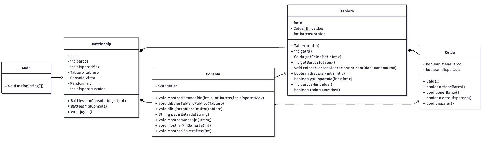

# Battleship Lite (Java, MVC)

A small console Battleship game used to teach **multidimensional arrays**, **MVC**, and clean separation of responsibilities. The gameplay and messages are in **Spanish** to match the course.

---

## What this project demonstrates

* 2D arrays as the core data structure (`Celda[][]` inside `Tablero`).
* Strict **MVC** separation:

  * **Modelo:** `Celda`, `Tablero`
  * **Vista:** `VistaConsola` (única responsable de I/O)
  * **Controlador:** `Battleship`
  * **Arranque:** `Main`
* Input parsing from human-friendly coordinates (e.g., `B3`) to indices.
* Validation to avoid re-shooting the same cell.
* Configurable game parameters (board size, number of ships, max shots) via constructor injection.

---

## Project structure

```
.
├── Celda.java          # Modelo: estado de una celda (barco / disparada)
├── Tablero.java        # Modelo: matriz de celdas, reglas de disparo y conteo
├── VistaConsola.java   # Vista: ÚNICA clase con System.in/out (I/O de consola)
├── Battleship.java     # Controlador: orquesta el flujo del juego (sin I/O directo)
└── Main.java           # Punto de entrada: crea Vista y Controlador y ejecuta
```

---

## MVC overview

* **Modelo (domain logic, sin I/O):**

  * `Celda`: representa una casilla del tablero, si tiene barco y si ya fue disparada.
  * `Tablero`: contiene la matriz de `Celda`, coloca barcos, procesa disparos, lleva conteos y estado de victoria.
* **Vista (presentación, I/O):**

  * `VistaConsola`: imprime el tablero público/oculto, muestra mensajes, solicita y lee entradas del usuario.
* **Controlador (coordinación):**

  * `Battleship`: gestiona el ciclo del juego, llama al modelo para reglas y a la vista para interacción.
* **Arranque:**

  * `Main`: configura la vista y el controlador y llama a `jugar()`.

> Solo **`VistaConsola`** hace impresión y lectura de consola. El modelo y el controlador no tocan I/O.

---

## Class-by-class

### `Celda`

* **Rol:** estado atómico del tablero.
* **Atributos clave:** `tieneBarco`, `disparada`.
* **Operaciones:** `ponerBarco()`, `disparar()`, getters para verificar estado.

### `Tablero`

* **Rol:** matriz `n x n` de `Celda` y reglas del juego.
* **Responsabilidades:**

  * Crear y mantener `Celda[][]`.
  * `colocarBarcosAleatorios(cantidad, rnd)`.
  * `disparar(r, c)` devuelve si fue **tocado**; valida “disparo repetido”.
  * `yaDisparada(r, c)`, `barcosHundidos()`, `todosHundidos()`.
* **No hace I/O.**

### `VistaConsola`

* **Rol:** interfaz con el usuario por consola.
* **Responsabilidades:**

  * Mensajes de bienvenida y fin de juego.
  * Representación del tablero público (oculta barcos) y oculto (para depuración).
  * Entrada de coordenadas y comandos (`SALIR`, `REVELAR`).

### `Battleship`

* **Rol:** controlador del juego.
* **Responsabilidades:**

  * Orquestar el loop de juego con límites de disparos.
  * Validar entradas, consultar/actualizar `Tablero`, pedir/mostrar a través de `VistaConsola`.
  * Parámetros configurables: tamaño, barcos, disparos máximos.
* **No hace I/O directo.**

### `Main`

* **Rol:** arranque mínimo.
* **Responsabilidades:** crear `VistaConsola`, instanciar `Battleship` y llamar `jugar()`.

---

## How to build and run

Requisitos: JDK 17+ recomendado.

```bash
javac *.java
java Main
```

Por defecto, el juego corre con un tablero 5x5, 3 barcos (tamaño 1) y 12 disparos.

---

## Gameplay (Spanish)

* **Coordenadas:** escribe valores como `A1`, `C5` (no sensibles a mayúsculas).
* **Comandos especiales:**

  * `REVELAR` muestra el tablero oculto para depuración.
  * `SALIR` termina la partida.
* **Símbolos en el tablero público:**

  * `.` desconocido
  * `O` agua (fallo)
  * `X` tocado (acierto)

---

## Configuration

```java
public class Main {
    public static void main(String[] args) {
        Battleship juego = new Battleship();
        juego.jugar();
    }
}
```

---

## Testing ideas / classroom prompts

* Explique por qué la **Vista** es la única clase que hace I/O.
* Muestre cómo `B3` se convierte en índices `(1, 2)`.
* ¿Qué ocurre si intenta disparar dos veces a la misma celda? ¿Por qué el Modelo lanza excepción?
* Extensión: coloque barcos de longitud 2 horizontal/vertical y valide colisiones.

---

## Class diagram



---

## License

Add your preferred license here (e.g., MIT).
